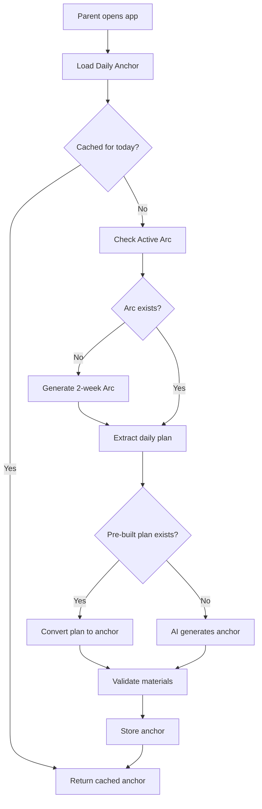

# FamilyPath Anchor Generation Refactoring - Walkthrough

> **Last Updated:** February 6, 2026  
> **Status:** ✅ All Phases Complete, Ready for Testing

---

## Overview

This walkthrough documents the comprehensive refactoring of the Anchor Generation Logic for FamilyPath's AI-first Living Curriculum. The goal was to implement safety guardrails, context awareness, optimize plan generation, and ensure individual child progress tracking.

### Key Accomplishments

1. **Unified Anchor Model** - One "Anchor Card" per family per day
2. **Safety Guardrails** - Material whitelist, age-specific safety rules
3. **Context Awareness** - Weather, time, parent mood injection
4. **Optimized Generation** - Pre-built arc plans, AI fallback
5. **Feedback Loop** - Progress tracking influences future arcs
6. **Simplified Chat Companion** - Cortex rewritten as focused "Anchor Companion"
7. **Debug Infrastructure** - Comprehensive `/api/debug/*` routes

---

## Architecture



---

## Changes Made

### Phase 4: Anchor Generator Rewrite ✅

**File:** [anchor-generator.ts](file:///c:/Users/Anthony%20Mwesigwa/Documents/Home%20Line%20Shop/stage-builder/cloudflare/src/ai/anchor-generator.ts)

| Feature | Description |
|---------|-------------|
| Material Whitelist | Only safe, common household materials allowed |
| Age Safety Rules | No sharp objects for under-6, no choking hazards for under-3 |
| Context Injection | Weather, time available, parent mood affect suggestions |
| Pre-built Plans | Prioritize using arc's daily_plans over AI generation |
| Reasoning Storage | AI explains why it chose each activity |

**Material Whitelist Sample:**
```typescript
const MATERIAL_WHITELIST = [
    // Kitchen
    'measuring cups', 'measuring spoons', 'mixing bowl', 'wooden spoon',
    // Art
    'crayons', 'colored pencils', 'markers', 'watercolors', 'paper',
    // Nature
    'leaves', 'sticks', 'rocks', 'flowers', 'seeds', 'magnifying glass',
    // ...
];
```

---

### Phase 5: Cortex Simplification ✅

**File:** [cortex.ts](file:///c:/Users/Anthony%20Mwesigwa/Documents/Home%20Line%20Shop/stage-builder/cloudflare/src/ai/cortex.ts)

| Metric | Before | After |
|--------|--------|-------|
| Lines of Code | 895 | ~280 |
| Bundle Impact | ~1274 KB | ~1177 KB |
| Reduction | — | **70% fewer lines, 97 KB smaller** |

**Deleted Files:**
- `frontdesk.ts` - Legacy NLU triaging
- `router.ts` - Intent routing
- `triage.ts` - Message classification
- `planner.ts` - Activity planning

**New Intent Detection:**
```typescript
const FEEDBACK_PATTERNS = {
    COMPLETE: /\[complete\]|done|finished|completed/i,
    SKIP: /\[skip\]|skip|pass|not today/i,
    ADJUST: /\[adjust\]|adjust|modify|change|instead/i,
    REGENERATE: /\[regenerate\]|regenerate|new plan|different/i,
    FEEDBACK: /\[feedback:(.+)\]/i
};
```

---

### Phase 6: Feedback Loop ✅

**Migration:** [v2_0054_anchor_feedback.sql](file:///c:/Users/Anthony%20Mwesigwa/Documents/Home%20Line%20Shop/stage-builder/cloudflare/migrations/v2_0054_anchor_feedback.sql)

**New Database Fields:**
```sql
-- Added to daily_anchors
ALTER TABLE daily_anchors ADD COLUMN completion_feedback TEXT;
ALTER TABLE daily_anchors ADD COLUMN completed_at TEXT;
ALTER TABLE daily_anchors ADD COLUMN skipped_at TEXT;
ALTER TABLE daily_anchors ADD COLUMN skip_reason TEXT;

-- New summary table
CREATE TABLE anchor_feedback_summary (
    id TEXT PRIMARY KEY,
    household_id TEXT NOT NULL,
    arc_id TEXT NOT NULL,
    total_completed INTEGER DEFAULT 0,
    total_skipped INTEGER DEFAULT 0,
    avg_rating REAL,
    common_feedback TEXT,
    improvement_suggestions TEXT
);
```

**API Endpoints:** [anchor.ts](file:///c:/Users/Anthony%20Mwesigwa/Documents/Home%20Line%20Shop/stage-builder/cloudflare/src/routes/anchor.ts)

| Endpoint | Method | Description |
|----------|--------|-------------|
| `/api/anchor/today` | GET | Get today's anchor (cached or generated) |
| `/api/anchor/regenerate` | POST | Force regenerate with adjustments |
| `/api/anchor/complete` | POST | Mark complete with rating/notes/lovedIt |
| `/api/anchor/skip` | POST | Skip with reason |
| `/api/anchor/history` | GET | Last 14 days of anchor history |

---

### Phase 7: Frontend Updates ✅

**File:** [ChatPanel.tsx](file:///c:/Users/Anthony%20Mwesigwa/Documents/Home%20Line%20Shop/stage-builder/src/components/chat/ChatPanel.tsx)

**Changes:**
- Bot identity: "Frontdesk Officer" → "Anchor Companion"
- Welcome message: "Good morning! I'm your Anchor Companion. I'll help guide your family through today's learning anchor."
- Removed stale "lions" placeholder filtering code

---

## Debug Routes

**File:** [debug.ts](file:///c:/Users/Anthony%20Mwesigwa/Documents/Home%20Line%20Shop/stage-builder/cloudflare/src/routes/debug.ts)

| Endpoint | Method | Description |
|----------|--------|-------------|
| `/api/debug/status` | GET | Overall system status (DB, arc, anchor, children) |
| `/api/debug/arc` | GET | Raw arc data (last 3) |
| `/api/debug/anchors` | GET | Recent anchors (last 14 days) |
| `/api/debug/force-arc` | POST | Force regenerate arc |
| `/api/debug/force-anchor` | POST | Force regenerate today's anchor |
| `/api/debug/progress` | GET | Child progress data |
| `/api/debug/logs` | GET | Recent AI interaction logs |

### Debug Logging

Key log prefixes for troubleshooting:
- `[ArcGenerator]` - Arc generation flow
- `[AnchorGenerator]` - Anchor generation flow
- `[Cortex]` - Chat/intent handling
- `[Debug]` - Debug endpoint calls

**Console Log Emojis:**
- 🧠 = Chat entry point
- 📅 = Anchor operations
- 🎯 = Intent detection
- 🚀 = Intent routing
- 💬 = Chat flow
- ✅ = Success
- ⚠️ = Warning
- ❌ = Error

---

## Test Family Profile

Use this sample family throughout all testing steps.

### Parent Account
- **Name:** Grace Nakamya
- **Email:** grace@example.com
- **Household ID:** *(auto-generated on signup)*

### Children

| Name | Date of Birth | Age | Stage | Notes |
|------|--------------|-----|-------|-------|
| **Samuel Nakamya** | 2021-06-15 | 4 years 8 months (56 months) | Seedling | Loves animals, beginning to recognize letters |
| **Esther Nakamya** | 2023-11-02 | 2 years 3 months (27 months) | Seedling | Active toddler, enjoys music and movement |
| **Baby Joel Nakamya** | 2025-08-20 | 5 months | Seedling | Infant — observer role only |

### Expected Curriculum Positions (after spine generation)

| Subject | Week | Stage | Focus Area (example) |
|---------|------|-------|---------------------|
| Literacy | 1 | seedling | phonological_awareness |
| Numeracy | 1 | seedling | number_sense |
| Formation | 1 | seedling | daily_routines |
| Motor | 1 | seedling | gross_motor_play |

### Family Preferences
- **Morning minutes:** 30
- **Evening minutes:** 15
- **Available days:** `["monday","tuesday","wednesday","thursday","friday"]`
- **Goals:** `["faith_formation","early_literacy","family_bonding"]`

---

## Testing Checklist

### Phase 1: Database & Infrastructure

#### 1.1 System Status Check
```bash
curl https://your-api.workers.dev/api/debug/status \
  -H "Authorization: Bearer YOUR_TOKEN"
```

**Expected response:**
```json
{
  "timestamp": "2026-02-09T...",
  "householdId": "uuid",
  "database": "connected",
  "activeArc": null,
  "todayAnchor": null,
  "children": [
    { "name": "Samuel Nakamya", "dob": "2021-06-15" },
    { "name": "Esther Nakamya", "dob": "2023-11-02" },
    { "name": "Baby Joel Nakamya", "dob": "2025-08-20" }
  ],
  "curriculumPositions": []
}
```

**What to verify:**
- ✅ Database is connected
- ✅ All 3 children appear with correct DOBs
- ✅ No arc or anchor yet (first visit)
- ✅ `curriculumPositions` is empty (no spine generated yet)

---

### Phase 2: Curriculum Spine Generation (Admin)

#### 2.1 Generate Spine via Admin Dashboard
Navigate to `/admin/curriculum` and generate a spine for the **Seedling** stage.

**What to verify:**
- ✅ Spine entries created in `curriculum_spine` table for all 4 subjects (literacy, numeracy, formation, motor)
- ✅ `spine_version` is a timestamp format (e.g., `v1707500000000`)
- ✅ `spine_metadata` row created with `status = 'approved'`
- ✅ Each subject has 52 weeks of entries
- ✅ `confidence` field is `'standard'`

#### 2.2 Verify Spine Content
```bash
curl https://your-api.workers.dev/api/debug/progress \
  -H "Authorization: Bearer YOUR_TOKEN"
```

**What to verify:**
- ✅ No progress records yet (spine exists but family hasn't started)

---

### Phase 3: Arc Generation

#### 3.1 Generate First Arc
```bash
curl -X POST https://your-api.workers.dev/api/debug/force-arc \
  -H "Authorization: Bearer YOUR_TOKEN"
```

**Expected behavior:**
1. System detects no `family_curriculum_position` rows → auto-creates them at week 1
2. Fetches weekly targets from spine for weeks 1-2 across all 4 subjects
3. AI receives a human-readable **PROGRESS SUMMARY** like:
   ```
   - literacy: Week 1/52, focus on "phonological_awareness" (skills: sound_discrimination, rhyme_recognition)
   - numeracy: Week 1/52, focus on "number_sense" (skills: counting_1_to_5, one_to_one_correspondence)
   - formation: Week 1/52, focus on "daily_routines" (skills: morning_routine, cleanup_habits)
   - motor: Week 1/52, focus on "gross_motor_play" (skills: running, jumping, climbing)
   ```
4. Arc includes child-specific roles:
   - **Samuel (56mo):** Active participant, letter activities, counting games
   - **Esther (27mo):** Sensory play, movement, parallel activities
   - **Baby Joel (5mo):** Observer role, tummy time, sensory exposure

**What to verify:**
- ✅ `formation_arcs` row created with `status = 'active'`
- ✅ `spine_version` column populated (not NULL)
- ✅ `arc_data` JSON contains 14 `daily_plans`
- ✅ `generation_reasoning` explains the AI's choices
- ✅ Activities reference all 3 children by name

#### 3.2 Stage Detection Fix Verification
```bash
# Check that getStageFromSpineVersion correctly queries the DB
curl https://your-api.workers.dev/api/debug/arc \
  -H "Authorization: Bearer YOUR_TOKEN"
```

**What to verify:**
- ✅ Arc's stage is `seedling` (NOT the old default `sprout`)
- ✅ The `generation_reasoning` references seedling-appropriate activities

---

### Phase 4: Anchor Generation

#### 4.1 Get Today's Anchor
```bash
curl https://your-api.workers.dev/api/anchor/today \
  -H "Authorization: Bearer YOUR_TOKEN"
```

**Expected anchor structure:**
```json
{
  "id": "uuid",
  "date": "2026-02-09",
  "liturgy": {
    "catechism": { "number": 1, "question": "...", "answer": "..." },
    "hymn": { "title": "...", "lyrics": "..." },
    "scripture": { "reference": "...", "text": "..." }
  },
  "activity": {
    "title": "...",
    "description": "...",
    "duration_minutes": 25,
    "materials": ["measuring cups", "paper", "crayons"],
    "instructions": "Samuel (age 4), you'll lead... Esther (age 2), you can..."
  },
  "book_nook": {
    "title": "...",
    "path": "books/..."
  }
}
```

**What to verify:**
- ✅ Anchor cached in `daily_anchors` table
- ✅ Materials are from the whitelist (no scissors for under-6, no small beads for under-3)
- ✅ Activity instructions reference children by name and age
- ✅ Baby Joel has observer/sensory role only
- ✅ Second call to `/anchor/today` returns cached version (no re-generation)

#### 4.2 Regenerate (Shuffle)
```bash
curl -X POST https://your-api.workers.dev/api/anchor/regenerate \
  -H "Authorization: Bearer YOUR_TOKEN" \
  -H "Content-Type: application/json" \
  -d '{"context": {"weather": "rainy", "mood": "tired", "available_minutes": 15}}'
```

**What to verify:**
- ✅ Old anchor marked as replaced
- ✅ New anchor suggests indoor activities (rainy context)
- ✅ Shorter activity (~15 min, matching available_minutes)
- ✅ `regeneration_count` incremented

---

### Phase 5: Feedback Loop

#### 5.1 Complete an Anchor
```bash
curl -X POST https://your-api.workers.dev/api/anchor/complete \
  -H "Authorization: Bearer YOUR_TOKEN" \
  -H "Content-Type: application/json" \
  -d '{"anchorId": "ANCHOR_ID_FROM_4.1", "rating": 5, "notes": "Samuel loved the counting game!", "lovedIt": true}'
```

**What to verify:**
- ✅ `daily_anchors.status` → `'completed'`
- ✅ `completed_at` timestamp set
- ✅ `completion_feedback` contains the rating and notes

#### 5.2 Skip an Anchor
```bash
curl -X POST https://your-api.workers.dev/api/anchor/skip \
  -H "Authorization: Bearer YOUR_TOKEN" \
  -H "Content-Type: application/json" \
  -d '{"anchorId": "ANCHOR_ID", "reason": "Baby Joel was fussy, not enough time"}'
```

**What to verify:**
- ✅ `daily_anchors.status` → `'skipped'`
- ✅ `skipped_at` timestamp set
- ✅ `skip_reason` stored

#### 5.3 Check History
```bash
curl https://your-api.workers.dev/api/anchor/history \
  -H "Authorization: Bearer YOUR_TOKEN"
```

**What to verify:**
- ✅ Returns up to 14 days of anchors
- ✅ Completed and skipped anchors show correct statuses

---

### Phase 6: Chat Companion (Cortex)

#### 6.1 Test Intent Detection

| Message | Expected Intent | Expected Behavior |
|---------|-----------------|-------------------|
| "done" | `complete` | Marks today's anchor complete, asks for rating |
| "skip this" | `skip` | Marks skipped, asks for reason |
| "adjust the plan" | `adjust` | AI suggests modifications to current anchor |
| "give me a new plan" | `regenerate` | Generates fresh anchor |
| "[feedback: Samuel loved the rhyming game]" | `feedback` | Stores feedback, acknowledges |
| "What are we doing today?" | `chat` | Returns today's anchor briefing |

---

### Phase 7: Curriculum Advancement (Critical Path)

This tests the fixes from the audit (Issues 1 & 2).

#### 7.1 Simulate Arc Completion
After completing 14 anchors (or force-completing the arc), verify advancement:

**What to verify:**
- ✅ `family_curriculum_position.current_week` advances from 1 → 3 (2-week increment)
- ✅ All 4 subjects advance simultaneously
- ✅ Next arc generation fetches weeks 3-4 targets from spine

#### 7.2 Stage Transition (Week 52 → Next Stage)
Manually set a family's position to week 51 for one subject, then complete an arc:

**What to verify:**
- ✅ `getStageFromSpineVersion()` queries `curriculum_spine` table (NOT string parsing)
- ✅ `advanceCurriculumPosition()` joins `spine_metadata` + `curriculum_spine` to find next stage
- ✅ If Sprout spine exists and is approved: `current_week` resets to 1, `spine_version` updates
- ✅ If no Sprout spine exists: position caps at 52, logged with warning
- ✅ Other subjects remain at their current week (independent advancement)

---

### Phase 8: Frontend Verification

#### 8.1 Dashboard
- ✅ Daily Anchor Card renders with Liturgy, Activity, and Book Nook tabs
- ✅ Catechism Q&A displays correctly
- ✅ Hymn player loads audio
- ✅ "Read Now" opens BookReader
- ✅ Activity instructions show children's names

#### 8.2 Settings → Curriculum Tab
- ✅ Each child shows current week and stage (e.g., "Samuel — Week 3, Seedling")
- ✅ Progress updates after arc completion

#### 8.3 Chat Panel
- ✅ Welcome message says "Anchor Companion"
- ✅ Intents route correctly
- ✅ Anchor briefing card renders inline

---

## Known Considerations

> [!IMPORTANT]
> Debug routes are enabled in production. Add environment-based gating before launch.

> [!NOTE]
> The `anchor_feedback_summary` table is created but not auto-populated. Prepared for future weekly aggregation.

> [!TIP]
> To test stage transitions without waiting for 52 weeks, manually update `family_curriculum_position.current_week = 51` via the database.

---

## File Reference

### Backend (Cloudflare Worker)

| File | Purpose |
|------|---------|
| `cloudflare/src/ai/cortex.ts` | Anchor Companion chat handler |
| `cloudflare/src/ai/anchor-generator.ts` | Daily anchor generation with safety guardrails |
| `cloudflare/src/ai/arc-generator.ts` | 2-week arc generation + curriculum advancement |
| `cloudflare/src/ai/spine-generator.ts` | Curriculum spine generation (admin) |
| `cloudflare/src/routes/anchor.ts` | Anchor API routes |
| `cloudflare/src/routes/debug.ts` | Debug/troubleshooting routes |
| `cloudflare/src/ai/gemini.ts` | Gemini API integration |

### Frontend (React/Vite)

| File | Purpose |
|------|---------|
| `src/components/chat/ChatPanel.tsx` | Main chat interface |
| `src/components/chat/messages/AnchorBriefingMessage.tsx` | Anchor card display |

### Migrations

| File | Purpose |
|------|---------|
| `cloudflare/migrations/v2_0050_formation_arcs.sql` | Formation arcs table |
| `cloudflare/migrations/v2_0051_daily_anchors_v2.sql` | Daily anchors table |
| `cloudflare/migrations/v2_0052_curriculum_spine.sql` | Curriculum spine + metadata tables |
| `cloudflare/migrations/v2_0053_child_progress.sql` | Child progress tracking |
| `cloudflare/migrations/v2_0054_anchor_feedback.sql` | Feedback fields on anchors |

---

## Next Steps (Future Work)

1. **Feedback Aggregation** — Auto-populate `anchor_feedback_summary` weekly
2. **Arc Influence** — Use feedback patterns to adjust next arc generation
3. **Admin Dashboard** — Visualize curriculum effectiveness across families
4. **A/B Testing** — Compare pre-built vs AI-generated anchor effectiveness
