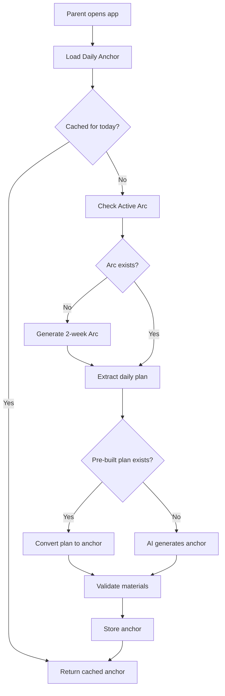

# FamilyPath Anchor Generation Refactoring - Walkthrough

> **Last Updated:** February 6, 2026  
> **Status:** ✅ All Phases Complete, Ready for Testing

---

## Overview

This walkthrough documents the comprehensive refactoring of the Anchor Generation Logic for FamilyPath's AI-first Living Curriculum. The goal was to implement safety guardrails, context awareness, optimize plan generation, and ensure individual child progress tracking.

### Key Accomplishments

1. **Unified Anchor Model** - One "Anchor Card" per family per day
2. **Safety Guardrails** - Material whitelist, age-specific safety rules
3. **Context Awareness** - Weather, time, parent mood injection
4. **Optimized Generation** - Pre-built arc plans, AI fallback
5. **Feedback Loop** - Progress tracking influences future arcs
6. **Simplified Chat Companion** - Cortex rewritten as focused "Anchor Companion"
7. **Debug Infrastructure** - Comprehensive `/api/debug/*` routes

---

## Architecture



---

## Changes Made

### Phase 4: Anchor Generator Rewrite ✅

**File:** [anchor-generator.ts](file:///c:/Users/Anthony%20Mwesigwa/Documents/Home%20Line%20Shop/stage-builder/cloudflare/src/ai/anchor-generator.ts)

| Feature | Description |
|---------|-------------|
| Material Whitelist | Only safe, common household materials allowed |
| Age Safety Rules | No sharp objects for under-6, no choking hazards for under-3 |
| Context Injection | Weather, time available, parent mood affect suggestions |
| Pre-built Plans | Prioritize using arc's daily_plans over AI generation |
| Reasoning Storage | AI explains why it chose each activity |

**Material Whitelist Sample:**
```typescript
const MATERIAL_WHITELIST = [
    // Kitchen
    'measuring cups', 'measuring spoons', 'mixing bowl', 'wooden spoon',
    // Art
    'crayons', 'colored pencils', 'markers', 'watercolors', 'paper',
    // Nature
    'leaves', 'sticks', 'rocks', 'flowers', 'seeds', 'magnifying glass',
    // ...
];
```

---

### Phase 5: Cortex Simplification ✅

**File:** [cortex.ts](file:///c:/Users/Anthony%20Mwesigwa/Documents/Home%20Line%20Shop/stage-builder/cloudflare/src/ai/cortex.ts)

| Metric | Before | After |
|--------|--------|-------|
| Lines of Code | 895 | ~280 |
| Bundle Impact | ~1274 KB | ~1177 KB |
| Reduction | — | **70% fewer lines, 97 KB smaller** |

**Deleted Files:**
- `frontdesk.ts` - Legacy NLU triaging
- `router.ts` - Intent routing
- `triage.ts` - Message classification
- `planner.ts` - Activity planning

**New Intent Detection:**
```typescript
const FEEDBACK_PATTERNS = {
    COMPLETE: /\[complete\]|done|finished|completed/i,
    SKIP: /\[skip\]|skip|pass|not today/i,
    ADJUST: /\[adjust\]|adjust|modify|change|instead/i,
    REGENERATE: /\[regenerate\]|regenerate|new plan|different/i,
    FEEDBACK: /\[feedback:(.+)\]/i
};
```

---

### Phase 6: Feedback Loop ✅

**Migration:** [v2_0054_anchor_feedback.sql](file:///c:/Users/Anthony%20Mwesigwa/Documents/Home%20Line%20Shop/stage-builder/cloudflare/migrations/v2_0054_anchor_feedback.sql)

**New Database Fields:**
```sql
-- Added to daily_anchors
ALTER TABLE daily_anchors ADD COLUMN completion_feedback TEXT;
ALTER TABLE daily_anchors ADD COLUMN completed_at TEXT;
ALTER TABLE daily_anchors ADD COLUMN skipped_at TEXT;
ALTER TABLE daily_anchors ADD COLUMN skip_reason TEXT;

-- New summary table
CREATE TABLE anchor_feedback_summary (
    id TEXT PRIMARY KEY,
    household_id TEXT NOT NULL,
    arc_id TEXT NOT NULL,
    total_completed INTEGER DEFAULT 0,
    total_skipped INTEGER DEFAULT 0,
    avg_rating REAL,
    common_feedback TEXT,
    improvement_suggestions TEXT
);
```

**API Endpoints:** [anchor.ts](file:///c:/Users/Anthony%20Mwesigwa/Documents/Home%20Line%20Shop/stage-builder/cloudflare/src/routes/anchor.ts)

| Endpoint | Method | Description |
|----------|--------|-------------|
| `/api/anchor/today` | GET | Get today's anchor (cached or generated) |
| `/api/anchor/regenerate` | POST | Force regenerate with adjustments |
| `/api/anchor/complete` | POST | Mark complete with rating/notes/lovedIt |
| `/api/anchor/skip` | POST | Skip with reason |
| `/api/anchor/history` | GET | Last 14 days of anchor history |

---

### Phase 7: Frontend Updates ✅

**File:** [ChatPanel.tsx](file:///c:/Users/Anthony%20Mwesigwa/Documents/Home%20Line%20Shop/stage-builder/src/components/chat/ChatPanel.tsx)

**Changes:**
- Bot identity: "Frontdesk Officer" → "Anchor Companion"
- Welcome message: "Good morning! I'm your Anchor Companion. I'll help guide your family through today's learning anchor."
- Removed stale "lions" placeholder filtering code

---

## Debug Routes

**File:** [debug.ts](file:///c:/Users/Anthony%20Mwesigwa/Documents/Home%20Line%20Shop/stage-builder/cloudflare/src/routes/debug.ts)

| Endpoint | Method | Description |
|----------|--------|-------------|
| `/api/debug/status` | GET | Overall system status (DB, arc, anchor, children) |
| `/api/debug/arc` | GET | Raw arc data (last 3) |
| `/api/debug/anchors` | GET | Recent anchors (last 14 days) |
| `/api/debug/force-arc` | POST | Force regenerate arc |
| `/api/debug/force-anchor` | POST | Force regenerate today's anchor |
| `/api/debug/progress` | GET | Child progress data |
| `/api/debug/logs` | GET | Recent AI interaction logs |

### Debug Logging

Key log prefixes for troubleshooting:
- `[ArcGenerator]` - Arc generation flow
- `[AnchorGenerator]` - Anchor generation flow
- `[Cortex]` - Chat/intent handling
- `[Debug]` - Debug endpoint calls

**Console Log Emojis:**
- 🧠 = Chat entry point
- 📅 = Anchor operations
- 🎯 = Intent detection
- 🚀 = Intent routing
- 💬 = Chat flow
- ✅ = Success
- ⚠️ = Warning
- ❌ = Error

---

## Testing Checklist

### 1. System Status Check
```bash
# Call the debug status endpoint
curl https://your-api.workers.dev/api/debug/status \
  -H "Authorization: Bearer YOUR_TOKEN"
```

Expected response:
```json
{
  "timestamp": "2026-02-06T...",
  "householdId": "uuid",
  "database": "connected",
  "activeArc": { "id": "...", "status": "active" },
  "todayAnchor": { "id": "...", "status": "active" },
  "children": [{ "name": "...", "dob": "..." }],
  "curriculumPositions": []
}
```

### 2. Force Generate New Arc
```bash
curl -X POST https://your-api.workers.dev/api/debug/force-arc \
  -H "Authorization: Bearer YOUR_TOKEN"
```

### 3. Force Generate Today's Anchor
```bash
curl -X POST https://your-api.workers.dev/api/debug/force-anchor \
  -H "Authorization: Bearer YOUR_TOKEN"
```

### 4. Test Chat Intents

| Message | Expected Intent |
|---------|-----------------|
| "done" | `complete` |
| "skip this" | `skip` |
| "adjust the plan" | `adjust` |
| "give me a new plan" | `regenerate` |
| "[feedback: loved the cooking activity]" | `feedback` |

### 5. Complete an Anchor with Feedback
```bash
curl -X POST https://your-api.workers.dev/api/anchor/complete \
  -H "Authorization: Bearer YOUR_TOKEN" \
  -H "Content-Type: application/json" \
  -d '{"anchorId": "anchor-uuid", "rating": 5, "notes": "Kids loved it!", "lovedIt": true}'
```

### 6. Skip an Anchor
```bash
curl -X POST https://your-api.workers.dev/api/anchor/skip \
  -H "Authorization: Bearer YOUR_TOKEN" \
  -H "Content-Type: application/json" \
  -d '{"anchorId": "anchor-uuid", "reason": "Not enough time today"}'
```

### 7. Check Anchor History
```bash
curl https://your-api.workers.dev/api/anchor/history \
  -H "Authorization: Bearer YOUR_TOKEN"
```

---

## Known Considerations

> [!IMPORTANT]
> The debug routes are enabled in production. Consider adding environment-based gating for security.

> [!TIP]
> Bundle size is now ~1180 KB (down from ~1275 KB). Further optimization possible by removing unused imports.

> [!NOTE]
> The `anchor_feedback_summary` table is created but not yet automatically populated. This is prepared for future feedback aggregation logic.

---

## File Reference

### Backend (Cloudflare Worker)

| File | Purpose |
|------|---------|
| [cortex.ts](file:///c:/Users/Anthony%20Mwesigwa/Documents/Home%20Line%20Shop/stage-builder/cloudflare/src/ai/cortex.ts) | Anchor Companion chat handler |
| [anchor-generator.ts](file:///c:/Users/Anthony%20Mwesigwa/Documents/Home%20Line%20Shop/stage-builder/cloudflare/src/ai/anchor-generator.ts) | Daily anchor generation with guardrails |
| [arc-generator.ts](file:///c:/Users/Anthony%20Mwesigwa/Documents/Home%20Line%20Shop/stage-builder/cloudflare/src/ai/arc-generator.ts) | 2-week formation arc generation |
| [anchor.ts](file:///c:/Users/Anthony%20Mwesigwa/Documents/Home%20Line%20Shop/stage-builder/cloudflare/src/routes/anchor.ts) | Anchor API routes |
| [debug.ts](file:///c:/Users/Anthony%20Mwesigwa/Documents/Home%20Line%20Shop/stage-builder/cloudflare/src/routes/debug.ts) | Debug/troubleshooting routes |
| [gemini.ts](file:///c:/Users/Anthony%20Mwesigwa/Documents/Home%20Line%20Shop/stage-builder/cloudflare/src/ai/gemini.ts) | Gemini API integration |

### Frontend (React/Vite)

| File | Purpose |
|------|---------|
| [ChatPanel.tsx](file:///c:/Users/Anthony%20Mwesigwa/Documents/Home%20Line%20Shop/stage-builder/src/components/chat/ChatPanel.tsx) | Main chat interface |
| [AnchorBriefingMessage.tsx](file:///c:/Users/Anthony%20Mwesigwa/Documents/Home%20Line%20Shop/stage-builder/src/components/chat/messages/AnchorBriefingMessage.tsx) | Anchor card display |

### Migrations

| File | Purpose |
|------|---------|
| [v2_0051_daily_anchors_v2.sql](file:///c:/Users/Anthony%20Mwesigwa/Documents/Home%20Line%20Shop/stage-builder/cloudflare/migrations/v2_0051_daily_anchors_v2.sql) | Daily anchors table |
| [v2_0052_curriculum_spine.sql](file:///c:/Users/Anthony%20Mwesigwa/Documents/Home%20Line%20Shop/stage-builder/cloudflare/migrations/v2_0052_curriculum_spine.sql) | Curriculum spine tables |
| [v2_0053_child_progress.sql](file:///c:/Users/Anthony%20Mwesigwa/Documents/Home%20Line%20Shop/stage-builder/cloudflare/migrations/v2_0053_child_progress.sql) | Child progress tracking |
| [v2_0054_anchor_feedback.sql](file:///c:/Users/Anthony%20Mwesigwa/Documents/Home%20Line%20Shop/stage-builder/cloudflare/migrations/v2_0054_anchor_feedback.sql) | Feedback fields |

---

## Build Verification

```
✅ Backend Build: 1179 KB bundled (293 KB gzip)
✅ Frontend Build: 954 KB main bundle (287 KB gzip)
✅ All migrations applied successfully
```

---

## Next Steps (Future Work)

1. **Feedback Aggregation** - Auto-populate `anchor_feedback_summary` weekly
2. **Arc Influence** - Use feedback patterns to adjust next arc generation
3. **Admin Dashboard** - Visualize curriculum effectiveness across families
4. **A/B Testing** - Compare pre-built vs AI-generated anchor effectiveness
