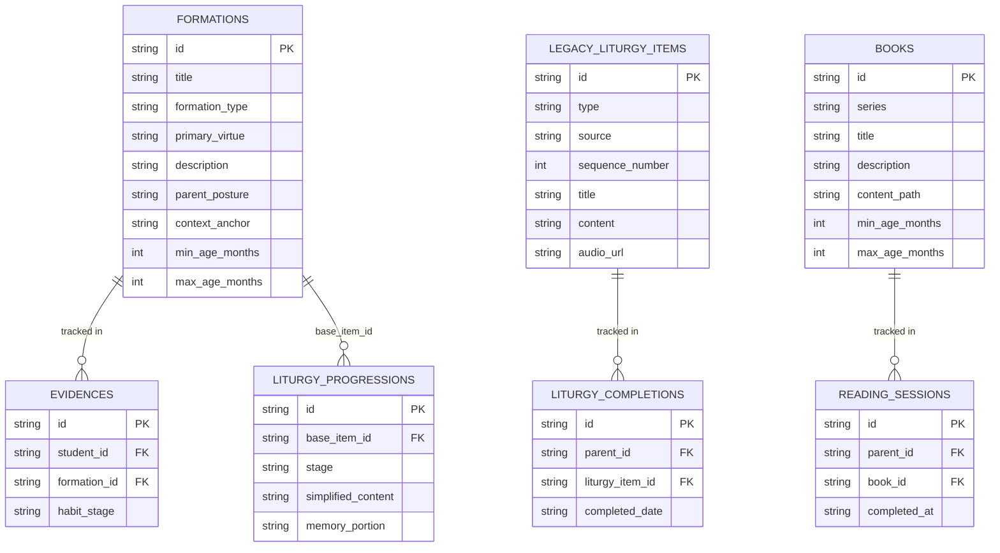
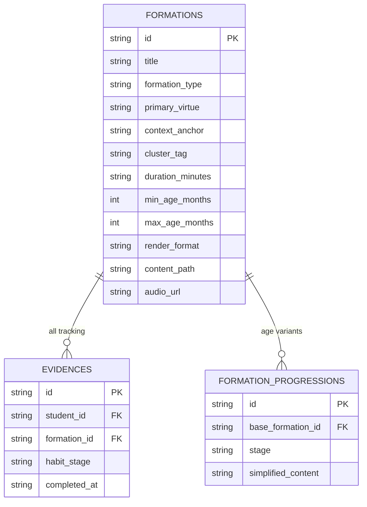
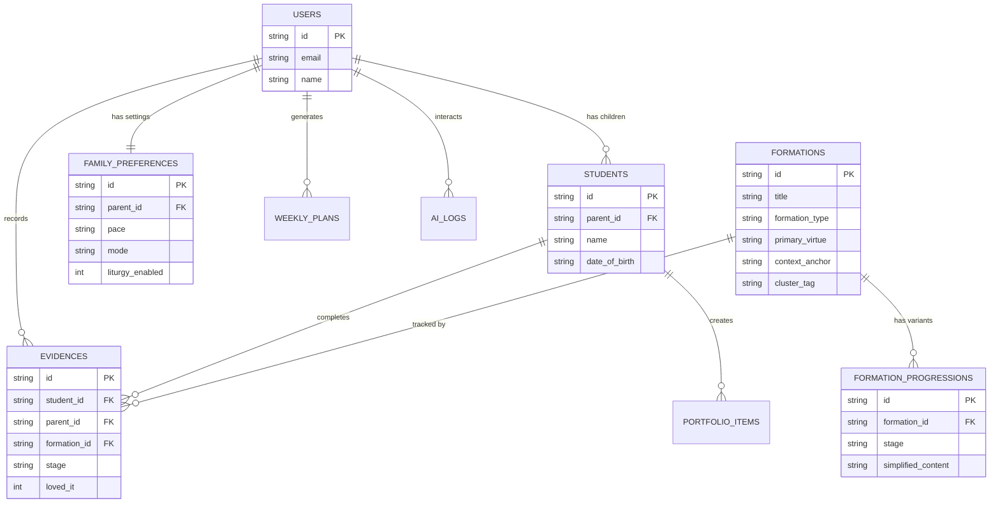

# SchoolOS Architecture: Current State vs Unified Activities Model

## Executive Summary

You're asking the right question. Your current architecture is a **layered accumulation** of features built over time:
- Activities → Formations (with virtues)
- Liturgy Items (Catechism, Hymns, Scripture) 
- Books (reading sessions)
- Liturgy Progressions (age-appropriate versions)
- Baby Mode overlays

The question is: **Should everything be an "Activity"?**

This document analyzes both approaches across your three evaluation criteria:
1. **Architecture** (Database, API, Frontend cleanliness)
2. **Parents** (Explainability to families)
3. **AI Integration** (Efficiency for training, retrieval, and generation)

---

## Part 1: What You Currently Have

### Current Data Model



### Current System: The Reality

| Entity | Table | Completion Tracking | How It's Served Daily |
|--------|-------|--------------------|-----------------------|
| Skills (Motor, Cognitive) | `formations` | `evidences` table | Weekly planner → `/api/family/today` |
| Habits | `formations` | `evidences` table | Weekly planner → `/api/family/today` |
| Catechism | `legacy_liturgy_items` + migrated to `formations` | `liturgy_completions` (old) OR appears as formation | **BUG: Appearing in Activity section under Wisdom** |
| Hymns | `legacy_liturgy_items` + migrated to `formations` | `liturgy_completions` (old) | Currently shown in Daily Liturgy section |
| Scripture/Memory Verses | `legacy_liturgy_items` + migrated to `formations` | `liturgy_completions` (old) | Currently shown in Daily Liturgy section |
| History | `formations` (type: 'skill') | `evidences` table | Pulled as activities |
| Books | `books` table (separate) | `reading_sessions` table | Separate "Reading" section |
| Baby Mode | Overlay filtering | N/A | Age-based filtering on all above |

### Current Bugs / Unintended Behaviors

> [!CAUTION]
> **Critical Issue: WSC Questions in Activity Section**
> 
> The migration `0038_formation_overhaul.sql` migrated ALL `legacy_liturgy_items` into `formations` table. This means:
> - Catechism questions are now `formation_type = 'liturgy'` 
> - But the planner (`planner.ts`) queries `formations` table WITHOUT filtering by `formation_type`
> - Result: Catechism appears as "activities" under Wisdom domain

**Root Cause in Code:**
```typescript
// planner.ts queries ALL formations
const activities = await db.prepare(`
  SELECT * FROM formations WHERE is_active = 1
`).bind().all();

// No filter for formation_type, so liturgy items get scored and planned
```

**Other Issues:**
1. **Duplicate Tracking**: Same catechism question can be tracked in BOTH `liturgy_completions` AND `evidences`
2. **Books are Orphaned**: Books don't participate in the formation engine at all
3. **Age Progressions Disconnect**: `liturgy_progressions` table only links to `formations` via `base_item_id`, but the daily suggestion logic doesn't use this
4. **Baby Mode is a Filter, Not a Structure**: It's applied as age-range filtering, not as a first-class concept

---

## Part 2: The Two Architectures

### Direction 1: Keep Current (Fix the Bugs)

This means:
- Keep `formations`, `legacy_liturgy_items`, `books` as separate tables
- Add `formation_type` filter to planner to exclude liturgy items from activity suggestions
- Keep Books as a separate reading track
- Baby Mode remains a filter

**Changes Required:**
1. Fix planner to filter `formation_type != 'liturgy'` for activity suggestions
2. Keep Liturgy section pulling from `formations` WHERE `formation_type = 'liturgy'`
3. Books remain separate with their own completion tracking

### Direction 2: Unified Activities Model

Everything becomes an Activity (Formation) with `formation_type` determining behavior:



**formation_type values:**
- `skill` - Motor, Cognitive, History activities
- `habit` - Cleanup, Greeting, Chores
- `liturgy` - Catechism, Hymns, Memory Verses
- `reading` - Books (NEW: books become formations)
- `service` - Acts of service
- `rest` - Sabbath, Nap time, etc.

---

## Part 3: The Comparison

### Criterion 1: Architecture (Database, API, Frontend)

| Aspect | Direction 1 (Fix Current) | Direction 2 (Unified) |
|--------|---------------------------|----------------------|
| **Tables** | 5+ tables (formations, legacy_liturgy_items, books, liturgy_completions, reading_sessions, evidences) | 3 tables (formations, evidences, formation_progressions) |
| **API Endpoints** | Multiple: `/api/family/today`, `/api/liturgy/today`, `/api/books`, `/api/reading-sessions` | Unified: Everything through `/api/formations` with type filtering |
| **Frontend Components** | Separate: `DailyRhythm`, `LiturgySection`, `BookReader` | Unified: `FormationCard` with type-based rendering |
| **Completion Tracking** | 3 systems: evidences, liturgy_completions, reading_sessions | 1 system: evidences (with formation_id) |
| **Query Complexity** | JOINs across multiple tables, legacy fallback logic | Single table queries with type filters |
| **Migration Effort** | Low (fix filters) | Medium (migrate books, unify completions) |

**Winner: Direction 2** - Dramatically simpler data model

---

### Criterion 2: Explainability to Parents

| Aspect | Direction 1 (Fix Current) | Direction 2 (Unified) |
|--------|---------------------------|----------------------|
| **Mental Model** | "You have Activities, then Daily Liturgy, then Reading Time" | "Everything is a Formation for your child's development" |
| **Where to Find Things** | 3 different sections, 3 different completion flows | 1 Library, filtered by type |
| **Progress View** | Fragmented: Activity progress, Liturgy streak, Books read | Unified: All formations tracked together by virtue |
| **Scheduling** | "Morning: Liturgy. Daytime: Activities. Evening: Reading." | "Your rhythm includes Skills, Habits, Liturgy, and Books - all formations" |
| **Language Consistency** | "Did you complete the activity? Did you practice catechism? Did you read the book?" | "Did you complete this formation?" |

**Parent Perspective:**

> [!IMPORTANT]
> **Current System Mental Model:**
> - "Why is Catechism showing up in my activity suggestions?"
> - "Where do I mark that we read a book?"
> - "Why are books separate from activities?"

> [!TIP]
> **Unified System Mental Model:**
> - "The app suggests formations. Some are skills, some are liturgy, some are books."
> - "I mark them all complete in the same way."
> - "My progress shows how we're doing across all areas."

**Winner: Direction 2** - Clearer mental model for parents

---

### Criterion 3: AI Integration Efficiency

This is where things get critical. Your goal is AI-powered personalization, retrieval, and generation.

| Aspect | Direction 1 (Fix Current) | Direction 2 (Unified) |
|--------|---------------------------|----------------------|
| **Embedding Generation** | Embed 3+ content types separately (activities, liturgy, books) | Embed ONE content type (formations) |
| **Vector Store** | Multiple indexes or complex metadata filtering | Single `formations` index with type metadata |
| **RAG Retrieval** | "Search activities, then liturgy, then books, then merge" | "Search formations WHERE type IN ('skill', 'liturgy', 'reading')" |
| **LLM Context** | "Here are activities... and also liturgy items... and also books..." | "Here are the family's formations..." |
| **Personalization Engine** | 3 different scoring algorithms (planner.ts, liturgy rotation, book recommendations) | 1 algorithm with type-aware weighting |
| **AI Coach Prompts** | Complex: Explain different data structures | Simple: "All data is formations with these fields" |
| **Training Data** | Multiple schemas to serialize | Single schema |

**The AI Integration Problem:**

```typescript
// Current: AI Coach has to understand multiple data structures
const prompt = `
  The family has these activities: ${JSON.stringify(activities)}
  And these liturgy items: ${JSON.stringify(liturgy)}
  And these books: ${JSON.stringify(books)}
  Generate a recommendation...
`;

// Unified: AI Coach works with one structure
const prompt = `
  The family's formations:
  ${JSON.stringify(formations)}
  Where formation_type indicates the category.
  Generate a recommendation...
`;
```

**Winner: Direction 2** - Massively simpler for AI

---

## Part 4: The Unified Model in Detail

If you go with Direction 2, here's what the data model looks like:

### Formations Table (Expanded)

```sql
CREATE TABLE formations (
  id TEXT PRIMARY KEY,
  title TEXT NOT NULL,
  
  -- TYPE & CLASSIFICATION
  formation_type TEXT NOT NULL CHECK (formation_type IN (
    'skill',      -- Motor, cognitive, history activities
    'habit',      -- Chores, routines, character habits
    'liturgy',    -- Catechism, hymns, memory verses
    'reading',    -- Books (NEW!)
    'service',    -- Acts of service
    'rest'        -- Sabbath, rest activities
  )),
  
  -- VIRTUE & FACULTY
  primary_virtue TEXT NOT NULL,
  biblical_faculty TEXT,
  
  -- CONTENT
  description TEXT NOT NULL,
  guide_steps TEXT,  -- JSON array
  parent_posture TEXT,
  liturgical_script TEXT,
  
  -- CONTEXT
  context_anchor TEXT,  -- 'Morning_Circle', 'Meal_Table', 'Walk_By_The_Way', 'Bedside', 'Anytime'
  cluster_tag TEXT,     -- 'catechism_wsc', 'hymn', 'history', 'math', 'reading'
  
  -- AGE RANGE
  min_age_months INTEGER DEFAULT 0,
  max_age_months INTEGER DEFAULT 216,
  
  -- READING-SPECIFIC (for formation_type = 'reading')
  content_path TEXT,      -- '/books/series/book/content.md'
  cover_image_url TEXT,
  page_count INTEGER,
  render_format TEXT,     -- 'markdown', 'image', 'pdf'
  
  -- LITURGY-SPECIFIC (for formation_type = 'liturgy')
  sequence_number INTEGER,
  audio_url TEXT,
  source TEXT,            -- 'westminster_shorter', 'trinity_hymnal'
  
  -- METADATA
  duration_minutes INTEGER DEFAULT 15,
  materials TEXT,         -- JSON array
  is_active INTEGER DEFAULT 1,
  created_at TEXT DEFAULT (datetime('now')),
  updated_at TEXT DEFAULT (datetime('now'))
);
```

### How Books Become Formations

```sql
-- Migrate books to formations
INSERT INTO formations (
  id, title, formation_type, primary_virtue, description,
  context_anchor, cluster_tag, min_age_months, max_age_months,
  content_path, cover_image_url, page_count, render_format, duration_minutes
)
SELECT 
  id,
  title,
  'reading',           -- NEW formation_type
  'Wisdom',            -- Books cultivate wisdom
  description,
  'Bedside',           -- Default context
  'reading_' || domain, -- e.g., 'reading_language'
  min_age_months,
  max_age_months,
  content_path,
  cover_image_url,
  page_count,
  'markdown',          -- or detect from book
  15                   -- estimated reading time
FROM books;
```

### How Planner Changes

```typescript
// planner.ts - Updated for unified model

// Skill formations (planned activities)
const skillFormations = await db.prepare(`
  SELECT * FROM formations 
  WHERE is_active = 1 
  AND formation_type IN ('skill', 'habit', 'service')
`).bind().all();

// Liturgy formations (daily rotation, not planned)
const liturgyFormations = await db.prepare(`
  SELECT * FROM formations 
  WHERE is_active = 1 
  AND formation_type = 'liturgy'
  AND context_anchor = 'Morning_Circle'
`).bind().all();

// Reading formations (suggested daily)
const readingFormations = await db.prepare(`
  SELECT * FROM formations 
  WHERE is_active = 1 
  AND formation_type = 'reading'
  ORDER BY RANDOM() LIMIT 1
`).bind().all();
```

### How Completion Tracking Unifies

```sql
-- BEFORE: 3 separate tracking tables
-- evidences (for formations)
-- liturgy_completions (for liturgy)
-- reading_sessions (for books)

-- AFTER: Just evidences
CREATE TABLE evidences (
  id TEXT PRIMARY KEY,
  student_id TEXT,
  family_id TEXT,          -- For family-level completions (books, liturgy)
  formation_id TEXT NOT NULL,
  habit_stage TEXT,        -- 'Seeding', 'Rooting', 'Fruiting'
  notes TEXT,
  duration_minutes INTEGER,
  captured_at TEXT DEFAULT (datetime('now')),
  FOREIGN KEY (formation_id) REFERENCES formations(id)
);
```

---

## Part 5: Baby Mode Reconsidered

Currently Baby Mode is an age filter. In a unified model, it becomes cleaner:

### Option A: Baby Mode as Formation Variant

Use `formation_progressions` to have baby-appropriate versions:

```sql
INSERT INTO formation_progressions (base_formation_id, stage, simplified_content)
VALUES 
('wsc_q1', 'seedling', 'God made us to love Him!'),
('wsc_q1', 'sprout', 'Why did God make people?'),
('wsc_q1', 'sapling', 'What is man''s chief end?');
```

The app selects the right progression based on child's age.

### Option B: Baby Mode as Formation Filter

```typescript
// If baby mode is ON (any child < 24 months):
const formations = await db.prepare(`
  SELECT * FROM formations 
  WHERE formation_type IN ('skill', 'habit')
  AND cluster_tag NOT IN ('reading', 'writing', 'math')
  AND context_anchor IN ('Anytime', 'Morning_Circle', 'Meal_Table')
  AND min_age_months <= ?
`).bind(youngestChildAge).all();
```

### Option C: Baby Mode as Pace Setting

Add to `formation_preferences`:
```sql
ALTER TABLE formation_preferences ADD COLUMN mode TEXT DEFAULT 'standard' 
  CHECK (mode IN ('baby', 'standard', 'accelerated'));
```

The planner adjusts session count and duration based on mode.

---

## Part 6: User Preferred Migration Path - Fresh D1 Database

> [!IMPORTANT]
> **User Decision: Start Fresh**
> 
> Rather than migrating the existing database with its 15+ tables, legacy prefixes, and accumulated technical debt, we will create a **new, clean D1 database** built from scratch with the unified model.

### Why Start Fresh?

The current database was built iteratively while exploring different directions:
- Multiple schema changes via migrations (54+ migration files)
- Legacy tables with `legacy_` prefix that are still being queried
- Redundant tracking systems (`evidences`, `liturgy_completions`, `reading_sessions`)
- Orphaned columns and relationships

**Starting fresh eliminates all technical debt in one move.**

### The Clean Schema (v2)

#### Core Tables (6 Tables)

```sql
-- ============================================================================
-- 1. USERS (Parents)
-- ============================================================================
CREATE TABLE users (
  id TEXT PRIMARY KEY,
  email TEXT NOT NULL UNIQUE,
  name TEXT NOT NULL,
  avatar_url TEXT,
  provider TEXT NOT NULL DEFAULT 'google',
  created_at TEXT NOT NULL DEFAULT (datetime('now')),
  updated_at TEXT NOT NULL DEFAULT (datetime('now'))
);

CREATE INDEX idx_users_email ON users(email);

-- ============================================================================
-- 2. STUDENTS (Children)
-- ============================================================================
CREATE TABLE students (
  id TEXT PRIMARY KEY,
  parent_id TEXT NOT NULL,
  name TEXT NOT NULL,
  date_of_birth TEXT NOT NULL,
  avatar_url TEXT,
  created_at TEXT NOT NULL DEFAULT (datetime('now')),
  updated_at TEXT NOT NULL DEFAULT (datetime('now')),
  FOREIGN KEY (parent_id) REFERENCES users(id) ON DELETE CASCADE
);

CREATE INDEX idx_students_parent ON students(parent_id);

-- ============================================================================
-- 3. FORMATIONS (Everything: Skills, Liturgy, Books, Habits)
-- The single source of truth for all educational content
-- ============================================================================
CREATE TABLE formations (
  id TEXT PRIMARY KEY,
  title TEXT NOT NULL,
  description TEXT NOT NULL,
  
  -- TYPE & CLASSIFICATION
  formation_type TEXT NOT NULL CHECK (formation_type IN (
    'skill',      -- Motor, cognitive, history, math, etc.
    'habit',      -- Chores, routines, character habits
    'liturgy',    -- Catechism, hymns, memory verses
    'reading',    -- Books
    'service',    -- Acts of service
    'rest'        -- Sabbath, nap time, quiet activities
  )),
  
  -- VIRTUE & FACULTY (Kingdom-oriented categories)
  primary_virtue TEXT NOT NULL CHECK (primary_virtue IN (
    'Wisdom', 'Stewardship', 'Love', 'Order', 'Wonder'
  )),
  biblical_faculty TEXT,
  
  -- CONTEXT & RHYTHM
  context_anchor TEXT CHECK (context_anchor IN (
    'Morning_Circle', 'Meal_Table', 'Walk_By_The_Way', 
    'Bedside', 'Anytime', 'Transition', 'Sabbath'
  )),
  cluster_tag TEXT,  -- 'catechism', 'hymn', 'history', 'math', 'motor', etc.
  
  -- AGE RANGE
  min_age_months INTEGER NOT NULL DEFAULT 0,
  max_age_months INTEGER NOT NULL DEFAULT 216,
  
  -- CONTENT FIELDS
  guide_steps TEXT,        -- JSON array of steps
  parent_posture TEXT,     -- How parent should approach this
  liturgical_script TEXT,  -- Call-and-response or recitation
  materials TEXT,          -- JSON array of materials needed
  duration_minutes INTEGER DEFAULT 15,
  
  -- READING-SPECIFIC (formation_type = 'reading')
  content_path TEXT,       -- '/books/series/book/content.md'
  cover_image_url TEXT,
  page_count INTEGER,
  render_format TEXT CHECK (render_format IN (
    'markdown', 'image', 'pdf', 'hymnal', 'catechism'
  )),
  
  -- LITURGY-SPECIFIC (formation_type = 'liturgy')
  sequence_number INTEGER, -- Week position for rotation
  audio_url TEXT,
  source TEXT,             -- 'westminster_shorter', 'trinity_hymnal', 'esv'
  
  -- METADATA
  is_active INTEGER NOT NULL DEFAULT 1,
  content_source TEXT DEFAULT 'schoolos_core',
  created_at TEXT NOT NULL DEFAULT (datetime('now')),
  updated_at TEXT NOT NULL DEFAULT (datetime('now'))
);

CREATE INDEX idx_formations_type ON formations(formation_type);
CREATE INDEX idx_formations_virtue ON formations(primary_virtue);
CREATE INDEX idx_formations_context ON formations(context_anchor);
CREATE INDEX idx_formations_cluster ON formations(cluster_tag);
CREATE INDEX idx_formations_age ON formations(min_age_months, max_age_months);

-- ============================================================================
-- 4. FORMATION_PROGRESSIONS (Age-appropriate versions)
-- ============================================================================
CREATE TABLE formation_progressions (
  id TEXT PRIMARY KEY,
  formation_id TEXT NOT NULL,
  stage TEXT NOT NULL CHECK (stage IN (
    'seedling',  -- 0-24 months
    'sprout',    -- 2-4 years
    'sapling',   -- 5-8 years
    'tree',      -- 9-12 years
    'oak'        -- 13+ years
  )),
  simplified_content TEXT NOT NULL,
  memory_portion TEXT,
  parent_teaching_note TEXT,
  created_at TEXT NOT NULL DEFAULT (datetime('now')),
  FOREIGN KEY (formation_id) REFERENCES formations(id) ON DELETE CASCADE
);

CREATE INDEX idx_progressions_formation ON formation_progressions(formation_id);
CREATE INDEX idx_progressions_stage ON formation_progressions(stage);
CREATE UNIQUE INDEX idx_progressions_unique ON formation_progressions(formation_id, stage);

-- ============================================================================
-- 5. EVIDENCES (All completion tracking - unified)
-- ============================================================================
CREATE TABLE evidences (
  id TEXT PRIMARY KEY,
  student_id TEXT,          -- NULL for family-level (liturgy, reading)
  parent_id TEXT NOT NULL,  -- Always track which parent
  formation_id TEXT NOT NULL,
  stage TEXT CHECK (stage IN ('Seeding', 'Rooting', 'Fruiting')),
  notes TEXT,
  duration_minutes INTEGER,
  loved_it INTEGER DEFAULT 0,  -- Passion signal
  captured_at TEXT NOT NULL DEFAULT (datetime('now')),
  FOREIGN KEY (student_id) REFERENCES students(id) ON DELETE CASCADE,
  FOREIGN KEY (parent_id) REFERENCES users(id) ON DELETE CASCADE,
  FOREIGN KEY (formation_id) REFERENCES formations(id) ON DELETE CASCADE
);

CREATE INDEX idx_evidences_student ON evidences(student_id);
CREATE INDEX idx_evidences_parent ON evidences(parent_id);
CREATE INDEX idx_evidences_formation ON evidences(formation_id);
CREATE INDEX idx_evidences_date ON evidences(captured_at);

-- ============================================================================
-- 6. FAMILY_PREFERENCES (Settings, pace, overrides)
-- ============================================================================
CREATE TABLE family_preferences (
  id TEXT PRIMARY KEY,
  parent_id TEXT NOT NULL UNIQUE,
  
  -- Pace & Mode
  pace TEXT DEFAULT 'standard' CHECK (pace IN ('gentle', 'standard', 'accelerated')),
  mode TEXT DEFAULT 'standard' CHECK (mode IN ('baby', 'standard', 'independent')),
  learning_focus TEXT DEFAULT 'balanced' CHECK (learning_focus IN ('balanced', 'interests', 'gaps')),
  
  -- Stream Toggles
  activities_enabled INTEGER DEFAULT 1,
  reading_enabled INTEGER DEFAULT 1,
  liturgy_enabled INTEGER DEFAULT 1,
  
  -- Liturgy Progress (weekly rotation)
  current_catechism_week INTEGER DEFAULT 1,
  current_hymn_week INTEGER DEFAULT 1,
  current_scripture_week INTEGER DEFAULT 1,
  
  -- Overrides (JSON)
  overrides_json TEXT DEFAULT '{}',
  
  created_at TEXT NOT NULL DEFAULT (datetime('now')),
  updated_at TEXT NOT NULL DEFAULT (datetime('now')),
  FOREIGN KEY (parent_id) REFERENCES users(id) ON DELETE CASCADE
);

CREATE INDEX idx_preferences_parent ON family_preferences(parent_id);
```

#### Support Tables (3 Tables)

```sql
-- ============================================================================
-- 7. WEEKLY_PLANS (Cache for generated plans)
-- ============================================================================
CREATE TABLE weekly_plans (
  id TEXT PRIMARY KEY,
  parent_id TEXT NOT NULL,
  week_start TEXT NOT NULL,  -- YYYY-MM-DD (Monday)
  plan_json TEXT NOT NULL,   -- Full plan structure
  balance_preference TEXT DEFAULT 'mixed',
  created_at TEXT NOT NULL DEFAULT (datetime('now')),
  FOREIGN KEY (parent_id) REFERENCES users(id) ON DELETE CASCADE
);

CREATE INDEX idx_plans_parent_week ON weekly_plans(parent_id, week_start);

-- ============================================================================
-- 8. AI_LOGS (Interaction tracking)
-- ============================================================================
CREATE TABLE ai_logs (
  id TEXT PRIMARY KEY,
  parent_id TEXT NOT NULL,
  student_id TEXT,
  interaction_type TEXT NOT NULL CHECK (interaction_type IN ('explain', 'socratic', 'feedback', 'search')),
  question TEXT NOT NULL,
  answer TEXT NOT NULL,
  context_json TEXT,  -- Related formation, etc.
  created_at TEXT NOT NULL DEFAULT (datetime('now')),
  FOREIGN KEY (parent_id) REFERENCES users(id) ON DELETE CASCADE
);

CREATE INDEX idx_ai_logs_parent ON ai_logs(parent_id);
CREATE INDEX idx_ai_logs_date ON ai_logs(created_at);

-- ============================================================================
-- 9. PORTFOLIO_ITEMS (Child work samples)
-- ============================================================================
CREATE TABLE portfolio_items (
  id TEXT PRIMARY KEY,
  student_id TEXT NOT NULL,
  parent_id TEXT NOT NULL,
  title TEXT NOT NULL,
  description TEXT,
  item_type TEXT NOT NULL CHECK (item_type IN ('image', 'audio', 'document', 'text')),
  r2_key TEXT,
  formation_id TEXT,
  milestone_tag TEXT,
  created_at TEXT NOT NULL DEFAULT (datetime('now')),
  FOREIGN KEY (student_id) REFERENCES students(id) ON DELETE CASCADE,
  FOREIGN KEY (parent_id) REFERENCES users(id) ON DELETE CASCADE
);

CREATE INDEX idx_portfolio_student ON portfolio_items(student_id);
```

### What Gets Deleted (Legacy Cleanup)

These tables are **NOT in the new database**:

| Old Table | Replaced By |
|-----------|-------------|
| `legacy_activities` | `formations` |
| `legacy_observations` | `evidences` |
| `legacy_liturgy_items` | `formations` (type='liturgy') |
| `liturgy_items` | `formations` (type='liturgy') |
| `liturgy_completions` | `evidences` |
| `books` | `formations` (type='reading') |
| `reading_sessions` | `evidences` |
| `activity_completions` | `evidences` |
| `daily_recommendations` | `weekly_plans` |
| `family_liturgy_settings` | `family_preferences` |
| `parent_overrides` | `family_preferences.overrides_json` |
| `formation_preferences` | `family_preferences` |
| `passion_signals` | `evidences.loved_it` |
| `liturgy_progressions` | `formation_progressions` |

**Result: 15+ tables → 9 clean tables**

### Data Model Diagram (Clean)



### Migration Strategy

1. **Create new D1 database** (`schoolos-v2` or similar)
2. **Export content data** from current database (formations, progressions only)
3. **Transform and import** into new schema
4. **Update worker binding** to point to new database
5. **Keep old database** for reference/rollback for 30 days
6. **Delete old database** after verification

---

## Part 7: Final Recommendation

### The Verdict

| Criterion | Direction 1 (Fix Current) | Direction 2 (Unified) |
|-----------|---------------------------|----------------------|
| Architecture | ⭐⭐ | ⭐⭐⭐⭐⭐ |
| Parents | ⭐⭐⭐ | ⭐⭐⭐⭐ |
| AI Integration | ⭐⭐ | ⭐⭐⭐⭐⭐ |

> [!IMPORTANT]
> **My Recommendation: Go with Direction 2 (Unified Activities Model)**
> 
> The short-term migration effort is worth it because:
> 1. **AI will be simpler** - One data model to embed, retrieve, and reason about
> 2. **Parents will understand** - "Everything is a formation"
> 3. **Maintenance is lower** - One table, one tracking system, one API
> 4. **Future features are easier** - AI curriculum generation, personalized pacing, family progress

### The Risk of Staying with Direction 1

If you just fix the bugs:
- You'll still have 3+ completion tracking systems
- AI integration will require complex merging logic
- Every new feature (subjects, grades, etc.) will add another layer
- Technical debt compounds

### The Path Forward

1. **Create `schoolos-v2` D1 database** with clean schema
2. **Export formations content** from current database
3. **Seed new database** with transformed data
4. **Update API worker** to use new database
5. **Verify and clean up**

---

## Appendix: Answering Your Specific Questions

### "How do Catechism questions get pulled to daily suggestions?"

**Current (Bug):** They're in `formations` table, planner queries all formations, they get scored and suggested as activities.

**Fix:** Add `WHERE formation_type NOT IN ('liturgy', 'reading')` to planner query.

**Right Way (Unified):** Liturgy formations are pulled by `/api/liturgy/today` based on `sequence_number` rotation, NOT by the activity planner.

### "Can Subjects also be Activities?"

**Yes.** In the unified model:
- `formation_type = 'skill'`
- `cluster_tag = 'math'` or `'history'` or `'reading'`
- Same tracking, same planner, same AI

### "Where do Books fit?"

**Unified Model:** Books become `formation_type = 'reading'` with:
- `content_path` for markdown
- `page_count` for length
- `render_format` for display logic
- Tracked in `evidences` like everything else

### "What about Baby Mode?"

**Unified Model:** Baby Mode becomes:
1. Age-appropriate content via `formation_progressions`
2. Pace setting in `family_preferences.mode`
3. Context filtering to appropriate anchors (Meal_Table, Bedside)

---

## Next Steps

With this architecture approved:
1. **Create fresh D1 database schema SQL file**
2. **Write data export/transform scripts**
3. **Update Cloudflare worker binding**
4. **Refactor frontend types and API calls**

**This document serves as the architectural foundation for SchoolOS v2.**
